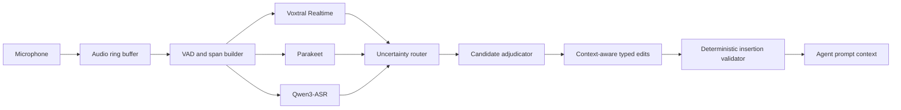

# Resident Agent Voice-Ingestion Pipeline

**Status:** Draft v0.2 — outside review (voice-pipeline Claude, 2026-08-06) incorporated; seven points accepted, see changelog. Steward: Review Lead.  
**Target hardware:** Apple M3 Max, 128 GB unified memory  
**Primary use case:** Private, local-first, long-form dictation into an agent context window

## 0. Span state lattice (normative vocabulary)

One lattice, used identically everywhere in this document:

`provisional → stable → frozen → adjudicated → committed → accepted`

| Transition | Writer |
|---|---|
| provisional → stable | realtime lane (text unchanged across revisions, audio outside mutable tail) |
| stable → frozen | span builder (span boundary closed) |
| frozen → adjudicated | uncertainty router + adjudicator |
| adjudicated → committed | deterministic insertion validator |
| committed → accepted | the user (explicit turn acceptance) |

No section may introduce another state name; "agreed" in prose means *adjudicated with no disputed subspans*.

## 1. Purpose

Build a resident voice-ingestion service that can accept monologues of ten minutes or longer, produce useful provisional text while the user is speaking, and deliver a context-aware final prompt shortly after the user explicitly ends the turn.

The system must improve terminology and transcription errors without making the user's speech more conventionally grammatical. In particular, it must preserve omitted subjects, fragments, repetition, hedging, and other intentionally or habitually elliptical constructions.

## 2. Goals

- Produce low-latency provisional text from a genuinely incremental ASR session.
- Finalize the recording continuously so end-of-turn latency does not grow with dictation length.
- Combine acoustically and linguistically different ASR models instead of trusting one model's confidence.
- Use conversational context to resolve terminology while preventing contextual rewriting.
- Re-listen only to uncertain time spans.
- Preserve raw audio, hypotheses, decisions, and edits until the turn is accepted.
- Operate locally by default. Any cloud escalation requires an explicit user setting.

## 3. Non-goals

- Producing polished prose unless the user explicitly requests a separate rewrite.
- Adding inferred subjects, objects, transitions, or conclusions.
- Treating silence as the end of a turn.
- **Content-vs-command routing** ("scratch that paragraph" as a directive rather than dictation): deliberately deferred to the agent layer. The span schema reserves `channel: "content" | "directive"` (default `"content"`, set only downstream) so ingestion needs no redesign when that layer arrives.
- Retranscribing the complete recording every few seconds or at end of turn.
- Using generic WER as the sole quality criterion.
- Running a full omni-modal model in the normal realtime path.

## 4. Model roles

| Model | Role | Execution mode |
|---|---|---|
| Voxtral Realtime 4B | Primary transcript and live preview | Continuous, stateful streaming |
| NVIDIA Parakeet TDT v3 | Independent acoustic witness, timing, and available confidence | Every committed audio span |
| Qwen3-ASR 1.7B | Context-biased alternate transcript | Every committed span at low priority; mandatory on flagged spans |
| Qwen3 ForcedAligner 0.6B | Timing for a winning Qwen correction when needed | On demand |
| Resident text LLM | Candidate adjudication and constrained cleanup | Frozen spans and end of turn |
| Qwen3-Omni | Exceptional audio-aware adjudication | Optional, outside MVP |

Voxtral is the default authority because it has produced the best raw transcription quality for this user. Parakeet and Qwen provide independent evidence and may replace a Voxtral span only under the rules in Section 10.

## 5. High-level architecture



The audio buffer is the source of truth. Text is a derived, revisable view until its span reaches the `accepted` state.

## 6. Audio ingestion and turn handling

### 6.1 Capture

- Capture mono, 16 kHz PCM suitable for all ASR backends.
- Audio capture must never wait on inference.
- Retain at least the active turn plus 30 seconds of margin.
- Keep the original captured samples available even if a processed channel is used for ASR.
- Apply echo cancellation only when system or agent audio can enter the microphone.

### 6.2 End-of-turn

The authoritative end-of-turn signal is explicit: key release, button press, or a configured voice command. VAD silence must not end a turn.

### 6.3 Span construction

Initial values, subject to personal-corpus tuning:

- Preferred span length: 10–25 seconds.
- Hard maximum span length: 30 seconds.
- Preferred split: 600–900 ms of detected silence.
- Boundary overlap: 500–750 ms.
- Mutable tail: most recent 3–5 seconds.
- **Seam dedup rule (v0.2):** overlapped boundaries duplicate words at every seam by construction. Merge adjacent spans by longest-common-suffix/prefix matching on normalized tokens (the streaming-ASR "local agreement" pattern). The merge is specified behavior, not a discovered bug: doubled words at seams are a validator-rejectable defect.

VAD is used to locate boundaries, suppress no-speech inference, and identify hallucinations. It is not used as a semantic endpoint detector.

## 7. Streaming and nearline processing

### 7.1 Realtime lane

Voxtral must run through a stateful incremental session with persistent encoder and decoder caches. Each call supplies only newly captured samples. Repeated transcription of an overlapping rolling window is prohibited.

Voxtral emits provisional deltas. Text becomes eligible for freezing only after it has remained stable and its audio is outside the mutable tail.

**Runtime risk and sanctioned fallback topology (v0.2, per outside review):** genuine stateful incremental Voxtral on Apple Silicon is *unverified as locally runnable* at spec time (reported status: llama.cpp support at pending-PR level; the realtime variant was built for the served API; local incremental sessions likely require custom MLX work — verify at prototype time, not from this document). Phase 1 therefore begins with a **timeboxed incremental-Voxtral prototype**; if the timebox expires without a working stateful session, the pre-approved fallback topology activates without further design review: **realtime authority and quality authority decouple** — Parakeet TDT (mature streaming) owns the live preview lane; Voxtral runs batch on frozen 10–25 s spans, where it remains the default adjudication winner per Section 10. This preserves every authority rule unchanged (authority already operates on frozen spans; preview quality matters least) and keeps incremental Voxtral as the upgrade path when the runtime matures. Phase 1 cannot stall on a research subproject.

### 7.2 Nearline lane

When a span freezes:

1. Send the complete overlapped span to Parakeet.
2. Send it to Qwen3-ASR with lexical context.
3. Align the hypotheses to the same audio interval.
4. Calculate uncertainty signals.
5. Commit an agreed result or route the disputed subspan for adjudication.

The service must process spans during the monologue. Ending a ten-minute turn must not initiate a new ten-minute ASR request.

## 8. Context separation

The system maintains two distinct context stores.

### 8.1 Lexical context

May be supplied to an ASR model:

- Buddhist and psychological terminology.
- Names, product names, abbreviations, and unusual spellings.
- Confirmed pronunciation variants.
- Entities retrieved from the current discussion.

Lexical prompts should resemble vocabulary lists, not prose descriptions of what the user probably means.

**Per-engine reality (v0.2):** decode-time lexical biasing is *unverified per engine* — the open-weight Qwen3-ASR checkpoints do not document the hosted API's context-biasing feature; Parakeet's equivalent is a boosting list, not a prompt; local Voxtral promptability in transcribe mode needs verification at integration. The MVP must therefore assume the possibility that **no engine consumes lexical context at decode time**, in which case the glossary does all of its work in adjudication (§10.2 rule 3), which this design already supports. Each engine's actual biasing channel (prompt / boosting list / none) is recorded in the integration notes when measured; §7.2 step 2's "with lexical context" means *via whatever biasing channel that engine verifiably has, possibly none*.

### 8.2 Discourse context

May be supplied only to the adjudication and cleanup layers:

- Recent accepted turns.
- Current topic and argument.
- Relevant resident-agent memory.
- The user's known elliptical and subject-omitting speech patterns.

Discourse context must not authorize the creation of unspoken content.

## 9. Shared result contract

All engines must return a common structure without discarding backend-specific evidence.

```json
{
  "span_id": "uuid",
  "audio": {
    "start_ms": 120000,
    "end_ms": 137500,
    "source_ref": "turn-audio://...",
    "speech_occupancy": 0.91
  },
  "hypotheses": [
    {
      "engine": "voxtral-realtime-4b",
      "text": "thinking maybe related to anatta",
      "words": [],
      "scores": {},
      "revision_count": 2
    }
  ],
  "decision": {
    "text": "Thinking maybe related to anattā.",
    "status": "committed",
    "channel": "content",
    "selected_engine": "voxtral-realtime-4b",
    "risk_reasons": [],
    "edits": []
  }
}
```

The `scores` object may contain frame confidence, token confidence, word confidence, entropy, duration confidence, or model-specific values. Scores must be labeled by type and must not be presented as calibrated probabilities unless calibration has been measured.

## 10. Uncertainty and adjudication

### 10.0 Alignment substrate (v0.2 — the load-bearing detail)

"Materially disagree after time alignment" presumes an alignment substrate, and word-level timestamps are **not** available from all engines: Parakeet emits good ones; locally-run Voxtral may emit none; Qwen requires its ForcedAligner. The normative substrate is therefore:

- **Text-to-text alignment** by normalized-token edit distance between hypotheses;
- **anchored to Parakeet's word timings as the time skeleton** for all engines (this is §4's "timing" role, made explicit);
- an empty `"words": []` from an engine is expected, not exceptional — that hypothesis aligns textually and inherits interval estimates from the skeleton;
- where no Parakeet timing exists for a disputed region (Parakeet failure case, §13), time-aligned adjudication degrades to text-only alignment and the span carries a `degraded_alignment` risk reason.

### 10.1 Routing signals

A span or subspan is uncertain when one or more of the following is true:

- Voxtral and Parakeet materially disagree after time alignment.
- Parakeet exposes low confidence or high entropy.
- Voxtral revises the same region repeatedly.
- Text appears during a no-speech or low-speech interval.
- A token is close to an active glossary entry.
- The disputed token touches a span boundary.
- The output contains a known silence-hallucination pattern.
- No two engines support the same reading.

Initial routing should use explicit rules. A learned risk model may replace them after enough user-corrected data exists.

### 10.2 Decision rules

1. Voxtral wins by default when there is no material disagreement.
2. Two acoustically independent hypotheses agreeing on a disputed reading may override Voxtral.
3. A glossary-backed term replacement requires an aligned spoken interval; glossary presence alone is insufficient.
4. If evidence remains ambiguous, preserve the conservative Voxtral reading and record alternatives. Do not invent a synthesis that no engine heard.
5. Qwen3-Omni, if enabled, may select among supplied candidates. It may not freely transcribe or rewrite the surrounding sentence.

## 11. Contextual cleanup contract

The cleanup model must emit typed edits against a selected transcript. It must not return replacement prose.

Allowed operations:

- `select_candidate`
- `replace_aligned_span`
- `insert_punctuation`
- `change_capitalization`
- `delete_confirmed_no_speech_hallucination`
- `split_or_join_paragraph`
- `mark_unresolved`

Forbidden operations:

- Adding an inferred subject, object, transition, qualification, or conclusion.
- Expanding a fragment into a complete sentence.
- Reordering clauses for style.
- Removing hedges, repetitions, or self-corrections without explicit instruction.
- Replacing a passage merely because the result is more grammatical.

### 11.1 Hard subject-insertion rule

A lexical subject may be introduced only when:

- At least two independent acoustic hypotheses contain it; or
- One hypothesis contains it with strong, time-aligned acoustic evidence and the other hypotheses are explicitly inconclusive.

Conversation context is never evidence that a subject was spoken.

The final renderer must reject any cleanup edit that violates this rule.

Examples:

| Acoustic hypotheses | Valid final | Invalid final |
|---|---|---|
| “Went back and checked.” | “Went back and checked.” | “I went back and checked.” |
| “Thinking maybe related to anattā.” | “Thinking maybe related to anattā.” | “I think it may be related to anattā.” |

## 12. Scheduling and residency

All MVP models may remain loaded on the 128 GB M3 Max. A single scheduler controls execution because the models still share GPU and memory bandwidth.

Priority order:

1. Audio capture and buffer maintenance.
2. Voxtral incremental inference.
3. Parakeet on frozen spans.
4. Qwen3-ASR on frozen or flagged spans.
5. Forced alignment.
6. Text adjudication and cleanup.
7. Memory indexing and optional background learning.

Uncoordinated MLX inference from separate agents is prohibited. Realtime inference must be serialized or cooperatively scheduled through one service.

Benchmark Voxtral 4-bit against FP16 on the personal corpus. FP16 is affordable in memory, but it should be selected only if its measured accuracy benefit justifies additional compute and bandwidth.

## 13. Failure and degradation behavior

- If Parakeet fails, continue with Voxtral and Qwen and mark confidence degraded.
- If Qwen fails, continue with Voxtral and Parakeet.
- If all alternates fail, preserve the raw Voxtral transcript and audio reference.
- If a realtime backlog develops, drop optional nearline work temporarily; never drop captured audio.
- If cleanup fails validation, use the pre-cleanup selected transcript.
- Never replace a nonempty acoustic transcript with an empty LLM result.
- Cloud fallback is disabled by default and must be visible when enabled.

## 14. Privacy and retention

- Local processing is the default.
- Active-turn audio is retained until the user accepts or discards the turn.
- Longer retention is configurable and off by default.
- Stored audio and provenance records should use platform-protected local storage.
- A cloud request must identify the provider, audio interval, and reason for escalation in the provenance record.

## 15. Initial acceptance criteria

These are initial targets to be calibrated on real hardware.

| Measure | Target |
|---|---|
| Lost captured audio | 0 samples attributable to inference backpressure |
| First useful provisional text | p95 under 1 second after speech begins |
| Frozen-span processing | Sustained faster than realtime over a ten-minute turn |
| End-of-turn ASR latency | p95 under 3 seconds when nearline processing is caught up |
| Added subjects not supported by audio | 0 |
| Text emitted for pure silence | 0 accepted words |
| Provenance coverage | 100% of accepted lexical edits |
| Long-form behavior | No whole-turn retranscription in the normal path |

## 16. Evaluation plan

Create a manually transcribed personal corpus containing at least 30–60 minutes of:

- Long-form OCD and Buddhist-theory discussion.
- Subject omission and fragments.
- Technical terms and unusual pronunciations.
- Long pauses, trailing silence, and environmental noise.
- Self-corrections and repeated phrases.

Track:

- Subject-insertion count and rate.
- Technical-term accuracy.
- Silence hallucinations per minute of silence.
- WER and character error rate.
- Stable-prefix revision rate.
- Per-engine realtime factor and first-token latency.
- Percentage of audio sent to Qwen or optional escalation.
- Accepted and rejected cleanup edits by operation type.

Model and threshold choices should be made using this corpus rather than generic benchmark rankings.

## 17. Implementation phases

### Phase 1: Reliable primary path

- Audio ring buffer and span state machine.
- Genuine incremental Voxtral integration.
- VAD silence guard.
- Raw hypothesis and timing provenance.

### Phase 2: Acoustic ensemble

- Parakeet and Qwen processing on frozen spans.
- Shared result schema and alignment.
- Rule-based uncertainty routing.
- No whole-turn retranscription.

### Phase 3: Contextual cleanup

- Lexical/discourse context separation.
- Typed cleanup edits.
- Deterministic insertion validator.
- Confirmed-correction glossary learning.

### Phase 4: Personal calibration

- Evaluation corpus and metrics dashboard.
- Threshold tuning.
- Voxtral 4-bit versus FP16 decision.
- Optional Qwen3-Omni experiment on unresolved spans.

## 18. Open decisions

- VAD implementation and operating threshold.
- Parakeet runtime and which confidence fields it exposes on Apple Silicon — **including whether to run Parakeet via Core ML on the Neural Engine** (v0.2: takes the per-span witness off the GPU that Voxtral and the text LLM contend for; note this requires an ANE backend added to ADR-0001 D5's `resource_claims` enum, which is a separately ruled schema extension, not a voice-spec decision).
- Exact span agreement metric and initial thresholds.
- Audio retention duration and encryption format.
- Whether Qwen runs on every frozen span or only while nearline backlog is below a limit.
- Whether paragraph formatting occurs incrementally or only at end of turn.
- Whether optional cloud Voxtral Mini Transcribe V2 is worth supporting as a user-triggered verification mode.

## Changelog

- v0.1 — initial draft.
- v0.2 (2026-08-06) — outside review incorporated (an independent voice-pipeline-versed Claude; all seven points accepted after verification against the text): §0 state lattice unifying provisional/stable/frozen/adjudicated/committed/accepted with named transition writers; §6.3 seam dedup rule (local-agreement merge); §7.1 runtime-risk note + timeboxed incremental-Voxtral prototype + **sanctioned fallback topology** (Parakeet preview lane / Voxtral batch authority — the one design-shaped change, steward-recommended, owner validation invited); §10.0 alignment substrate (text-to-text anchored to Parakeet's time skeleton); §8.1 per-engine biasing reality (adjudication-only glossary as guaranteed path); §3 + §9 directive-channel non-goal with reserved `channel` field; §18 Parakeet-on-ANE open decision with the D5 schema-extension caveat.

## References

- [Mistral speech-transcription documentation](https://docs.mistral.ai/studio-api/audio/speech_to_text)
- [Qwen3-ASR 1.7B model card](https://huggingface.co/Qwen/Qwen3-ASR-1.7B-hf)
- [NVIDIA NeMo ASR documentation](https://docs.nvidia.com/nemo/speech/nightly/asr/intro.html)
- [NVIDIA NeMo confidence API](https://docs.nvidia.com/nemo-framework/user-guide/25.02/nemotoolkit/asr/api.html)
